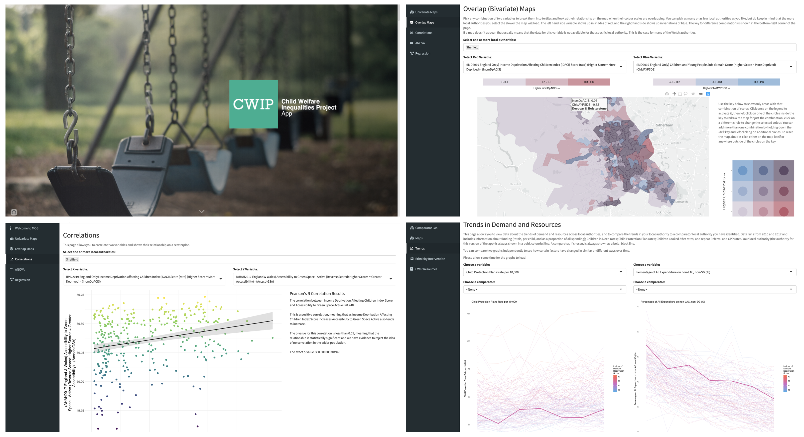

\colorlet{awesome}{awesome-emerald}


```{r setup, include=FALSE}

library(vitae)
library(rorcid)
library(tidyverse)
library(patchwork)
library(formattable)

# Generate orcid token using rorcid::orcid_auth()
orcid_token <- read_file("orcid_token")
Sys.setenv(ORCID_TOKEN = orcid_token)

options(encoding = "UTF-8")
#options(tinytex.verbose = TRUE)
options(knitr.kable.NA = '')
knitr::opts_chunk$set(echo = FALSE, warning = FALSE, message = FALSE)

```


<br>

# Summary

Dr Calum Webb is a sociologist with specialisation in data science, quantitative research, and statistical methods. He has worked on research projects ranging from national £500,000+ multi-institution studies, to small projects that deliver rapid findings and impact. His research topics include child welfare, poverty, and social policy, particularly the funding of children's services. His work has been cited by the Department for Education, Ofsted, and the National Audit Office, and is published in many top-ranking journals. He has presented at international conferences, including the European Conference for Social Work Research. He is interested in coproduced and participatory approaches to quantitative research. 

Calum is a co-founder of the AI in Housing, Welfare, and Social Care Network. He is an `R` user and has created `Rshiny` data visualisation apps for social work professionals that have been used by every local authority in England, as well as practice guidance for social workers in partnership with the British Association for Social Workers and Research in Practice. 

He has taught quantitative methods and statistical analysis to undergraduates and postgraduates studying sociology, occupational psychology, social policy, and social research, including core modules on accredited programmes. He is a proficient user of `R`, `Mplus`, `SPSS`, and `Stata`; he specialises in structural equation, multilevel, and latent growth modelling with secondary survey and administrative data. 

He is an external member of the *Cafcass* Research Advisory Committee and has been an advisor to the Department for Education's Children’s Social Care Analysis & Research Unit. He has acted as a consultant for directors of children's services at multiple local authorities, as well as in research institutions.  


# Education

```{r education}
#Code for updating education and qualifications

edu <- do.call("rbind",
  rorcid::orcid_educations("0000-0001-7521-2110")$`0000-0001-7521-2110`$`affiliation-group`$summaries
)
edu <- edu %>%
  detailed_entries(
    what = `education-summary.role-title`,
    when = glue::glue("{`education-summary.start-date.year.value`} - {`education-summary.end-date.year.value`}"),
    with = `education-summary.organization.name`,
    where = `education-summary.organization.address.city`
  )

edu$why <- c("Thesis: Constructing a reliable and valid measure of multidimensional poverty. Awarded without corrections. ESRC White Rose Scholarship.",
             "Dissertation: Children's outcomes and labour market activation: the potential of structural equation modelling and multivariate statistics for evidence based policy making. ESRC White Rose Scholarship.",
             "Dissertation: Online support groups, bipolar disorder, and the patient-professional relationship: an unobtrusive observation.")

edu

Sys.sleep(2) # Some sleep to stop 429 errors

```


# Employment

```{r employment}
# Get employment history from orcid - replace my orcid ID with yours
empl <- rorcid::orcid_employments("0000-0001-7521-2110")$`0000-0001-7521-2110`$`affiliation-group`$summaries

empl <- bind_rows(empl) %>%
  select(`employment-summary.department-name`,
         `employment-summary.organization.name`,
         `employment-summary.organization.address.city`,
         `employment-summary.role-title`,
         `employment-summary.end-date.year.value`,
         `employment-summary.start-date.year.value`) %>%
  mutate(
    `employment-summary.end-date.year.value` = ifelse(is.na(`employment-summary.end-date.year.value`), "Current", `employment-summary.end-date.year.value`)
  ) %>%
  detailed_entries(
    what = `employment-summary.role-title`,
    with = glue::glue("{`employment-summary.department-name`}, {`employment-summary.organization.name`}"),
    where = `employment-summary.organization.address.city`,
    when = glue::glue("{`employment-summary.start-date.year.value`} - {`employment-summary.end-date.year.value`}")
  )

# Add descriptions of employment - specific to me
emp_whys <- tibble(why = list(
      # RA Sociological studies
    c("Leading Articial Intelligence & Social Work: Strengthening Partnerships and Coproducing Priorities with BASW England",
      "Led analysis of children's services expenditure data in England and quantitative mixed methods lead for English case studies on the £0.55million Nuffield Foundation funded research project.",
    "Led analysis of survey data for the Family Rights Group's Care Crisis Review.",
    "Consultant methodologist for £0.26million research project analysing systemic drivers of demand in child protection.",
    "Impact case study co-author.",
    "Developed the Anti-Poverty Practice Guide for Social Work with the British Association of Social Workers.",
    "Worked in partnership with Sheffield City Council using national survey data to develop a policy learning tool for anti-poverty policy design.",
    "Published journal articles in high impact journals, with one article (Webb & Bywaters 2018) being in the top 1% of altmetric outputs.",
    "Developed the Child Welfare Inequalities Project App (www.cwip-app.co.uk) and the Mapping Overlaps Gadget (https://webb.shinyapps.io/MappingOverlapsGadget/) to consolidate and visualise local data.",
    "Co-founded the AI in Housing, Welfare, and Social Care Network (ai-hows.sheffield.ac.uk)."),
# Rasst Clinical Psychology
"Research project exploring ethics and governance processes in Clinical Psychology doctoral research projects.")
      )

# Add descriptions to descriptions
empl$why <- emp_whys$why

# return descriptions
empl

```

# Publications

```{r pubs_scrape, echo=FALSE, message=FALSE, include=FALSE}
# 
# For updating citations through Google Scholar, using scholar package
#

# Replace google scholar 12-unit ID with yours
pubs_df <- scholar::get_publications("CNYHo0IAAAAJ") %>%
  distinct(title, .keep_all = TRUE) %>%
  transmute(bibtype = "Article", author = as.character(author),
            title = as.character(title),
            journaltitle = as.character(journal), year, key = row_number(),
            number = as.character(number), cites = as.numeric(cites),
            pubid = as.character(pubid)
            )

# Get full authors list for each publication - by default scholar truncates long author lists, 
# can take some time but necessary to avoid 429 errors
authors_full = tibble(authors = character())

for (i in 1:nrow(pubs_df)) {

  pub_full_ch = scholar::get_complete_authors("CNYHo0IAAAAJ", pubid = pubs_df$pubid[i])
  authors_full[i, ] <- pub_full_ch
  Sys.sleep(1)

}

# Add full author list to author set
pubs_df$authors_full <- authors_full$authors

Sys.sleep(2)

```

```{r pubs_graphs, out.width="100%", fig.height=2.5}

# Get citation history - change to your scholar id
cites_stats <- scholar::get_citation_history("CNYHo0IAAAAJ")

# Create impact plot - this might break or require some fiddling with parameters depending on your citations
impact_plot <- scholar::get_impactfactor(pubs_df$journaltitle) %>%
  group_by(Journal) %>%
  summarise(n_articles = n(), ImpactFactor = first(ImpactFactor)) %>% 
  ggplot() +
  geom_point(aes(x = rank(desc(ImpactFactor)), y = ImpactFactor, size = n_articles, col = Journal)) +
  geom_text(aes(x = rank(desc(ImpactFactor)), y = ImpactFactor, label = n_articles), col = "white") +
  scale_size_continuous(range = c(10, 16)) +
  ylim(c(0, 3.75)) +
  xlim(c(0.5, 5.5)) +
  scale_y_continuous(breaks = seq(0, 3.75, 0.5), limits = c(0, 3.75)) +
  scale_color_brewer(type = "qual", palette = 4) +
  ylab("Impact Factor") +
  xlab("Rank of Impact Factor") +
  theme_minimal() +
  theme(legend.position = "none") +
  ggeasy::easy_all_text_size(size = 7) +
  ggeasy::easy_all_text_color(color = "grey50")

# Create cumulative and yearly citations plot - this shouldn't break too often and should
# be flexible to different profiles (see cites-grabber)
cumcite_plot <- cites_stats %>%
  ggplot() +
  geom_line(aes(x = year, y = cumsum(cites)), size = 1, col = "#C4EDC1") +
  geom_point(aes(x = year, y = cumsum(cites)), size = 2, col = "#8BDB86") +
  geom_bar(stat = "identity", aes(x = year, y = cites), size = 2, col = NA, fill = "#C4EDC1", alpha = 0.4) +
  geom_vline(xintercept = 2019.5, col = "#ADCEE5") +
  geom_text(aes(y = 152.5, x = 2019, label = "PhD Viva"), col = "#ADCEE5", size = 2.5) +
  xlab("Year") +
  ylab("Cumulative (line) Citations (bar)") +
  scale_x_continuous(breaks = seq(min(cites_stats$year), max(cites_stats$year), 1)) +
  theme_minimal() +
  ggeasy::easy_all_text_size(size = 7) +
  ggeasy::easy_all_text_color(color = "grey50")

# Return patchwork of two plots
cumcite_plot + impact_plot 

```


\renewcommand{\arraystretch}{1.5}


```{r publications}

# Create simplified refs table
refs_table <- pubs_df %>% 
  select(key, authors_full, year, everything()) %>%
  select(-author, -bibtype, -pubid, -key) %>%
  mutate(journal = paste(journaltitle, number, sep = ". ")) %>%
  select(-journaltitle, -number) %>%
  select(authors_full, year, title, journal, cites) %>%
  arrange(desc(year))

# Create latex kable of refs
knitr::kable(refs_table, "latex", booktabs = TRUE,
             col.names = c("Authors", "Year", "Title", "Journal", "Citations"),
             longtable = TRUE) %>%
  kableExtra::column_spec(1, width = "5cm") %>%
  kableExtra::column_spec(2, width = "0.75cm") %>%
  kableExtra::column_spec(3, width = "6cm") %>%
  kableExtra::column_spec(4, width = "2.5cm") %>%
  kableExtra::column_spec(5, width = "1cm") %>%
  kableExtra::row_spec(0, bold = TRUE) %>%
  kableExtra::kable_styling(latex_options = c("scale_down", "repeat_header"),
                            font_size = 8)

```


# Conference Papers

```{r confpapers}
# Grab conference papers from conf_papers.csv (must be manually updated)
conf_pres <- read_csv("conf_papers.csv", skip_empty_rows = TRUE)

# Arrange by year descending
conf_pres <- conf_pres %>%
  arrange(desc(year))

# Kable of conference papers
knitr::kable(conf_pres, "latex", booktabs = TRUE,
             col.names = c("Conference", "Presentation/Paper", "Year"),
             longtable = TRUE) %>%
  kableExtra::column_spec(1, width = "7.5cm") %>%
  kableExtra::column_spec(2, width = "7.5cm") %>%
  kableExtra::column_spec(3, width = "1.25cm") %>%
  kableExtra::row_spec(0, bold = TRUE) %>%
  kableExtra::kable_styling(latex_options = c("scale_down", "repeat_header"),
                            font_size = 8)

```


# Research Projects

```{r researchprojects}
# research projects dataset
res_proj <- read_csv("res_proj.csv", skip_empty_rows = TRUE)

res_proj <- res_proj %>%
  mutate(amount = scales::dollar(amount, prefix = "£")) %>%
  arrange(desc(year))

knitr::kable(res_proj, "latex", booktabs = TRUE,
             col.names = c("Funder", "Project", "Year", "Role", "Funding"),
             longtable = TRUE) %>%
  kableExtra::column_spec(1, width = "2.75cm") %>%
  kableExtra::column_spec(2, width = "7cm") %>%
  kableExtra::column_spec(3, width = "1.5cm") %>%
  kableExtra::column_spec(4, width = "2.25cm") %>%
  kableExtra::column_spec(5, width = "1.75cm") %>%
  kableExtra::row_spec(0, bold = TRUE) %>%
  kableExtra::kable_styling(latex_options = c("scale_down", "repeat_header"),
                            font_size = 8)


```

# Reports & Web Applications

```{r appshowcase, out.width = "100%"}
# App showcase image

```

```{r reports}
library(dplyr)

# Add outputs not otherwise known - generic reports, blogs, periodicals etc
reports_df <- read_csv("reports.csv")

reports_df <- reports_df %>%
  arrange(output_type, desc(year))

knitr::kable(reports_df, "latex", booktabs = TRUE,
             col.names = c("Output", "Title", "Organisation", "Year"),
             longtable = TRUE) %>%
  kableExtra::column_spec(1, width = "3cm") %>%
  kableExtra::column_spec(2, width = "7cm") %>%
  kableExtra::column_spec(3, width = "4cm") %>%
  kableExtra::column_spec(4, width = "2cm") %>%
  kableExtra::row_spec(0, bold = TRUE) %>%
  kableExtra::kable_styling(latex_options = c("scale_down", "repeat_header"),
                            font_size = 8)


```


# Teaching

```{r teaching}
# Read teaching information from teaching.csv file
teaching <- read_csv("teaching.csv", skip_empty_rows = TRUE)

teaching <- teaching %>% arrange(desc(year))

knitr::kable(teaching, "latex", booktabs = TRUE,
             col.names = c("Institute", "Module Name", "UG/PG", "Role", "Year"),
             longtable = TRUE) %>%
  kableExtra::column_spec(1, width = "4cm") %>%
  kableExtra::column_spec(2, width = "6cm") %>%
  kableExtra::column_spec(3, width = "2cm") %>%
  kableExtra::column_spec(4, width = "2cm") %>%
  kableExtra::column_spec(5, width = "1.5cm") %>%
  kableExtra::row_spec(0, bold = TRUE) %>%
  kableExtra::kable_styling(latex_options = c("scale_down", "repeat_header"),
                            font_size = 8)


```


